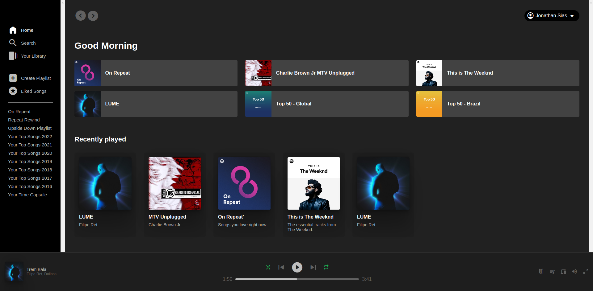

# Spotify UI

Apenas um projeto para recriar a interface do Spotify de algumas formas e brincar um pouco com algumas ferramentas e interface.

Basic Assets:
- Google Fonts
- Material Design Icons
- Some album arts

v1.0
- HTML
- CSS
- Spotify old interface

v2.0
- React
- Tailwind
- Lucide React Icons

Demo:

